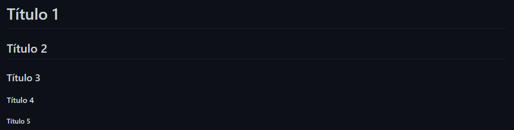
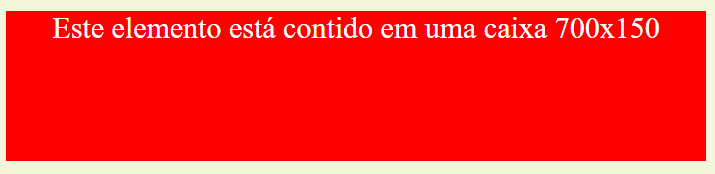
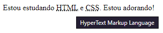

#  Markdown


## 1 - O que é Markdown? 🔍

Criado em 2004 por John Gruber, Markdown se refere a: (1) um modo de formatação de ficheiros de texto, e também (2) uma ferramenta Perl para converter ficheiros Markdown em HTML. Nesta lição, nosso foco será na primeira parte, aprender a escrever ficheiros utilizando a sintaxe Markdown.

Ficheiros de texto simples têm muitas vantagens sobre outros formatos. Uma delas é que são legíveis em praticamente qualquer dispositivo. Eles também resistem ao tempo melhor do que outros tipos de ficheiro - se abrir um documento salvo num formato de um processador de texto legado (como docx), estará familiarizado com os desafios de compatibilidade envolvidos.

Utilizando a sintaxe Markdown, você será capaz de produzir ficheiros que são legíveis como texto simples e também prontos para ser estilizados em outras plataformas. Vários sistemas de blogs, geradores de sites estáticos e sites como o GitHub também suportam Markdown, e renderizam esses ficheiros em HTML para exibição na web. Além disso, ferramentas como o Pandoc podem converter ficheiros de Markdown para outros formatos e vice-versa. Para mais informações sobre o Pandoc, visite a lição (em inglês) Sustainable authorship in plain text using Pandoc and Markdown, produzida por Dennis Tenen e Grant Wythoff.

[programming Historian sobre Markdown](https://programminghistorian.org/pt/licoes/introducao-ao-markdown)

## 2 - Títulos em Markdown 🅰️

O Título em markdown é representado, assim como em HTML, por uma hierarquia bem definida, porém diferentemente da linguagem de marcação HTML, em vez de utilizarmos as tags &lt;/&gt; seguidas do número que representa a hierarquia utilizamos a # em quantidades diferentes. Respectivamente, a ordem de hierarquia é a seguinte.

| Representação  | Hierarquia       | 
| -------------- | ----------       | 
|  #             |  # > ##          | 
|  ##            |  ## > ###        |     
|  ###           |  ### > ####      | 
|  ####          |  #### > #####    | 
|  #####         |  ##### > ######  |

Representação visual no repositório github:


 

## 3 - Listas ✔️

 As listas em Markdown podem ser representadas apenas adicionando um - na frente de uma linha ou, da mesma forma que o HTML.

Exemplo:

 ````
- coisa 1
- coisa 2
- coisa 3
 ````

- coisa 1
- coisa 2
- coisa 3

OU

````
<ul>
    <li>Comandos básicos HTML</li>
    <li>Símbolos Especiais</li>
    <li>Emojis</li>
</ul>
````
<ul>
    <li>Comandos básicos HTML</li>
    <li>Símbolos Especiais</li>
    <li>Emojis</li>
</ul>

OU 

```
    <ol type ="1">
        <li>To-do list</li>
            <ol type="A">
                <li>Acordar</li>
                <li>Tomar café</li>
                <li>Escovar os dentes</li>
            </ol>
        <li>To-do list 2</li>
         <ol type="A">
                <li>Acordar</li>
                <li>Tomar café</li>
             <li>Escovar os dentes</li>
         </ol>
    </ol>
```

Resultado:

<ol type ="1">
    <li>To-do list</li>
        <ol type="A">
             <li>Acordar</li>
            <li>Tomar café</li>
            <li>Escovar os dentes</li>
        </ol>
    <li>To-do list 2</li>
        <ol type="A">
            <li>Acordar</li>
            <li>Tomar café</li>
            <li>Escovar os dentes</li>
        </ol>
</ol>

## 4 - Imagens, Links e Gifs 🖼️🔗

Para adicionar uma imagem link ou gif, basta utilizar uma sintaxe que indica o nome que estará visível ao usuário e o link interno ou externo. Para imagens utilizamos o !, indicando que deve-se mostrar a imagem em vez do link desta mesma imagem. Exemplos abaixo:

Imagem:

````

````



Link:

````
[Screenshot](../Content/SCREENSHOTS/MarkdownTitle.png)
````

[Screenshot](../Content/SCREENSHOTS/caixa2.PNG)

## 5 - Representação de trechos de código ou texto pré-editado. 

 Isto evita que o Markdown reorganize o texto, deixando com a mesma edição e espaçamento da edição original.Podemos fazer isso colocando nosso código entre três ` ou através da tag &lt;pre&gt;&lt;/pre&gt;: 

   if (hour < 18) {
      greeting = "Good day";
    }
   


````
    if (hour < 18) {
      greeting = "Good day";
    }

````

## 6 - Emojis😀

😃😙😝😪

Os emojis podem ser encontrados pesquisando por emojipedia ou acessando: https://emojipedia.org/

    Para Markdown, basta copiar e colar.


## 7 - Símbolos Especiais (precisam ter o ; no final para funcionar)

- __*&lt*__ substitui o símbolo &lt;.

- __*&gt*__ substitui o símbolo &gt;.

- __*&reg*__ - marca registrada &reg;.

- __*&copy*__ - copyright &copy;.

- __*&trade*__ - trademark symbol &trade;.

- __*&euro*__ - Euro &euro;

- __*&pound*__ - Libra esterlina &pound;.

- __*&yen*__ - Ienes &yen;.

- __*&cent*__ - Centavos americanos &cent;.

- __*&empty*__ - Vazio &empty;.

- __*&sum*__ - Soma &sum;.

- __*&Delta*__ - Delta &Delta;.

- __*&larr*__ - Seta esquerda &larr;.

- __*&uarr*__ - Seta para cima &uarr;.

- __*&rarr*__ - Seta direita &rarr;.

- __*&darr*__ - Seta para baixo &darr;.

Ainda existem uma grande variedade de símbolos que podem ser encontradas pesquisando por misc symbols ou acessando: https://www.w3schools.com/charsets/ref_utf_symbols.asp


### 8.1 - TAGs de formatação.

- __*&lt;strong&gt;*__ - <strong>negrito</strong>, destaque

- __*&lt;em&gt;*__ - <em>italico</em>, enfase
- 
- __*&lt;del&gt;*__ - <del>texto deletado, riscado</del>

- __*&lt;ins&gt;*__ - <ins>texto inserido, sublinhado</ins>

- __*&lt;sup&gt;*__ - texto sobreescrito X<sup>20</sup>-3

- __*&lt;sub&gt;*__ - texto subescrito H<sub>2</sub>O

- __*&lt;pre&gt;*__ - mantém a identação do código, significa pré-formatado.

- __*&lt;q&gt;*__ - <q>deixa o texto como citação</q>

- __*&lt;blockquote&gt;*__ - cita um bloco de texto.

<blockquote>
        A diferença entre elementos inline e um bloco de texto é importante. Os elementos HTML neste capítulo descrevem os blocos de texto.
</blockquote>

- __*&lt;abbr&gt;*__ - abreviações, ao passar o mouse em cima mostra o nome completo.




