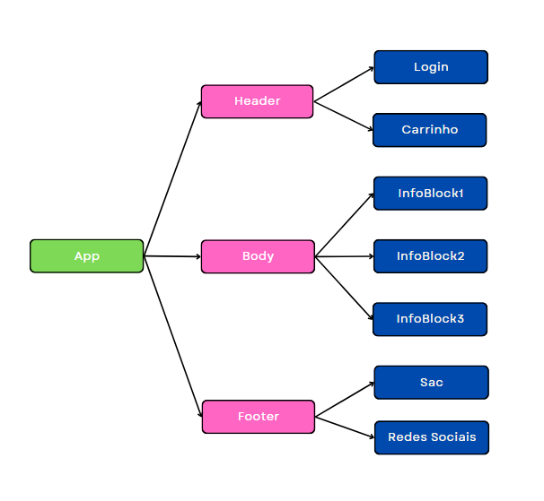
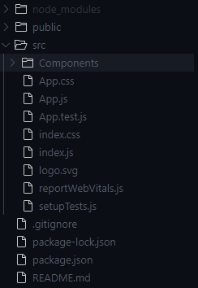
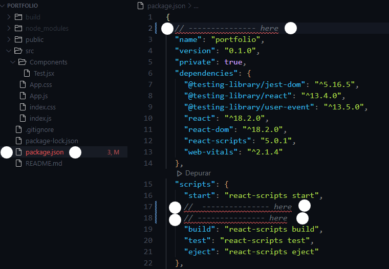
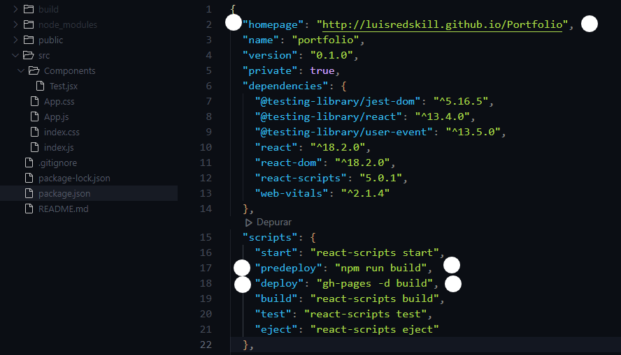

#  Markdown


## 1 - React como tecnologia🔍

### 1.1 - Índice de capítulo

- 1.1 - Índice de capítulo
- 1.2 - O que é React?
- 1.3 - Como funciona o React?

### 1.2 - O que é React?

React JS é uma biblioteca JavaScript para a criação de interfaces de usuário — ou UI (user interface).

Criado em 2011 pelo time do Facebook, o React surgiu com o objetivo de otimizar a atualização e a sincronização de atividades simultâneas no feed de notícias da rede social, entre eles chat, status, listagem de contatos e outros.

A princípio, todas essas atividades, chamadas de estados, tinham uma descrição muito complexa. Com o React, esta descrição torna-se mais simples, bem como também é simplificada a conexão entre HTML, CSS e JavaScript e todos os componentes de uma página.

Por ter demonstrado grande eficiência, nos anos que se seguiram o React foi incorporado à interface de outras redes sociais do grupo, como o Instagram e, em 2013, seu código foi aberto à comunidade, dando início a sua popularização.

Hoje, o React é uma das mais prestigiadas bibliotecas de JavaScript do mercado.

### 1.3 - Como funciona o React?

O React é uma biblioteca front-end e tem como um de seus objetivos facilitar a conexão entre diferentes partes de uma página, portanto seu funcionamento acontece através do que chamamos de componentes.

Em outras palavras, podemos imaginar que o React divide uma tela em diversos componentes para, então, trabalhar sobre eles de maneira individual.

Os componentes são utilizados para reaproveitamento de código e padronização de interface.

Isso torna o React uma tecnologia muito flexível para a solução de problemas e para a construção de interfaces reutilizáveis, uma vez que cada um destes componentes pode ser manipulado de maneira distinta.

[Kenzie sobre React](https://kenzie.com.br/blog/react/)

### 1.4 - Quais são as vatagens do React?

- Código declarativo
- Reuzabilidade

## 2 O que é JSX? 

    Para responder o que é JSX primeiro precisamos olhar para como Javascript puro é escrito e aplicado aos elementos. Por natureza, a organização, estilo e lógica das aplicações feitas em Javascript são feitas de forma separada o que muitas vezes não faz sentido uma vez que, em teoria, uma aplicação juntaria essas peças para interagirem umas com as outras depois de criadas.

    JSX é uma extensão de sintaxe para Javascript, adicionando elementos que são muito similares ao HTML permitindo ao programador facilitar essa intereção entre diferentes elementos.

## 3 - Criando um projeto React

### 3.1 - Índice de capítulo

- 3.1 - Índice de capítulo
- 3.2 - Como funciona o React?

### 3.2 - Maneira fácil de criar um projeto DEMO

Podemos adicionar React a um projeto através de CDNs, duas delas sendo depências React e uma delas sendo o compilador Babel para compilar o código em HTML-CSS-Javascript.


Adicionando react:
````
<script crossorigin src="https://unpkg.com/react@18/umd/react.development.js"></script>
<script crossorigin src="https://unpkg.com/react-dom@18/umd/react-dom.development.js"></script>
<script src="https://unpkg.com/babel-standalone@6/babel.min.js"></script>
````

Para que o babel seja utilizado devemos adicionar em nossa tag script o **type="text/babel"**.

```
<script src="meuJavascript.js" type="text/babel"></script>
```

### 3.2 - Aplicativo local (create-react-app)

Para criar um aplicativo local React podemos usar, dentro do diretório que o projeto será criado, o comando **create-react-app** diretamente no **cmd**.

A sintaxe padrão é **create-react-app** **minhaNovaAplicação**.

````
create-react-app novaAplicação
````

## 4 - Renderizando elementos HTML em react

A renderização de elementos HTML em react é feita através de uma função chamada ReactDOM.render. Esta função tem 2 parâmetros, o primeiro sendo o elemento HTML e o segundo sendo onde este elemento será inserido.

````
reactDOM.render(<h1>Hello, world!</h1>, document.getElementById("root"))
````

Esta função cria um elemento HTML H1, com o innerHTML "Hello, world!" e acrescenta ele ao elemento de id "root".

## 5 - Componentes

### 5.1 - Resumo

### 5.2 - O que são?

Componentes são partes modulares e reutilizáveis do código. Cada componente é único dentro do código e executa funções diferentes da UI. Sua grande vantagem é que são reutilizaveis em toda a aplicação.

Dentro de uma aplicação é muito comum que tenhamos um componente para o **Header**, outro para o **Body** e mais um para o **Footer**. Outro fator interessante é que não apenas esses componentes vão estar na aplicação, mas cada componente pode ser **filho** ou **pai** de outro componente.

Normalmente dentro do react, todos os componentes são filhos de **App**, que vai comportar todos os outros.

Fluxograma que representa o parentesco de cada Componente:



_**IMPORTANTE**_ - Todo **COMPONENTE** dentro do React é representado com a primeira letra maiúscula para diferenciar dos elementos HTML.

### 5.3 - Organizando os components


Para fins organizatórios, é indicado criar uma pasta para estes componentes novos que serão criados. Por convenção essa pasta tem o nome de **Components**.



### 5.2 - Estrutura de um componente

Um component é uma **função javascript**, sendo assim, quando chamado, nós estamos de fato chamando uma **função Js** que vai retornar nosso **HTML**. 

Exemplo:

````
import React from "react"

export default function() {
    return (
        <h1>Hello, world!</h1>
    )
}
````

Note que a primeira linha faz a importação do React para habilitar as funcionalidades do react. Logo abaixo temos a função que será exportada e seu respectivo HTML retornado.

### 5.3 - Importando um componente

Os componentes são partes de um código e ao mesmo tempo funções Javascript que serão exportadas. Porém a sintaxe de importação é um pouco diferente da normal.

Para importarmos um componente podemos importá-lo do topo do documento com a seguinte sintaxe:

````
import NomeDoComponente from "../Caminho/Do/Componente"
````

_**IMPORTANTE**_ - Note que a sintaxe do nome do componente **DEVE** ser em **MAIÚSCULO** para evitar que o compilador confunda elementos HTML com componentes React.

Exemplo:

````
import Header from "../src/Components/Header"
````

Neste exemplo estamos importando o **COMPONENTE HEADER** da pasta **COMPONENTS**.

Depois, para representá-lo visualmente em nossa aplicação, utilizamos o nome do componente em uma tag auto-fechada.

````
import Header from "../src/Components/Header"

function App() {
  return (
    <Header/>
  );
}
````

## 6 - Props

## 7 - React Deploy

## 7.1 - Resumo

## 7.2 - Github

1 -  [criamos um repositório](https://github.com/luisredskill/Conhecimentos/blob/main/Git/README.md#processo-de-cria%C3%A7%C3%A3o-de-reposit%C3%B3rio) e o tornamos público. Depois puxamos esse repositório para nossa máquina segundo 

2 - vamos [criar uma nova aplicação React](https://github.com/luisredskill/Conhecimentos/tree/main/React#32---aplicativo-local-create-react-app).

3 - Dentro do diretório criado, vamos incluir uma **dependência do github pages**. No cmd:

````
npm install gh-pages --save-dev

````

4 -  adicionaremos ao **package.json**, localizado dentro de nosso projeto, as seguintes alterações.



- Adicionar key "homepage" no começo do arquivo.
  ````
  "homepage": "http://myUserName.github.io/MyRepository"

  "homepage": "http://luisredskill.github.io/Portfolio",
  ````

  - Dentro de "scripts", adicionar depois de start: "predeploy" e "deploy" com os seguintes comandos:
  ````
   "predeploy": "npm run build",
    "deploy": "gh-pages -d build",
  ````

  

  
5 - Rodaremos o comando:

Este comando cria uma versão de produção da página e upa ela diretamente para o gh-pages, tudo em um único comando depois de configurar como citado nas etapas 1 a 4.

````
npm run deploy
````


